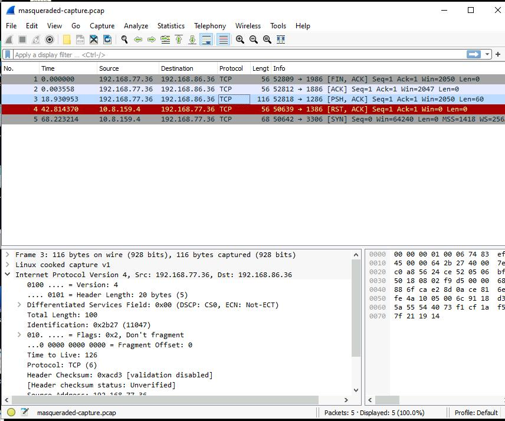
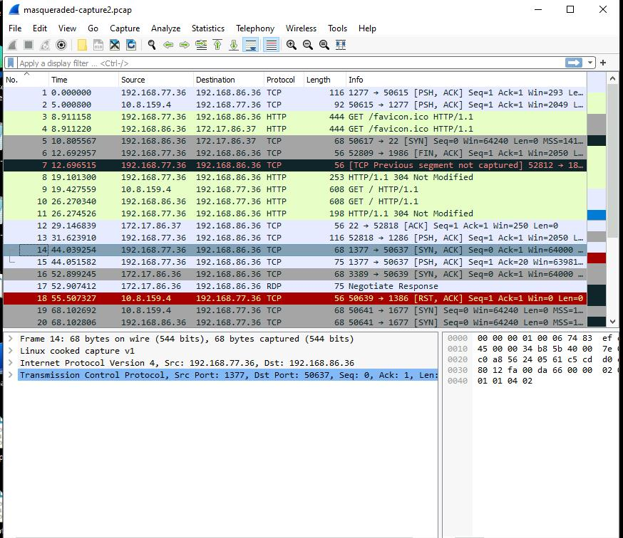
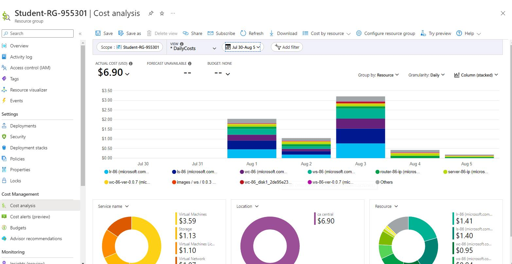
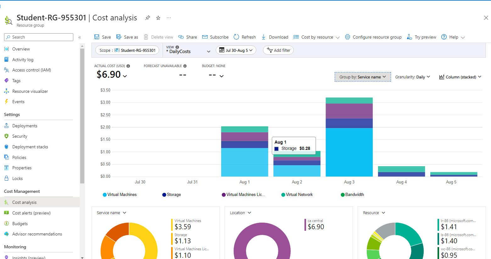
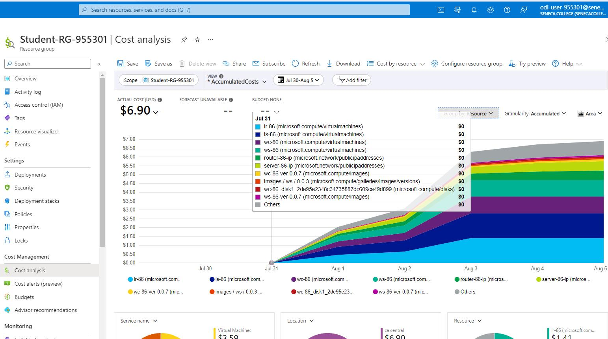
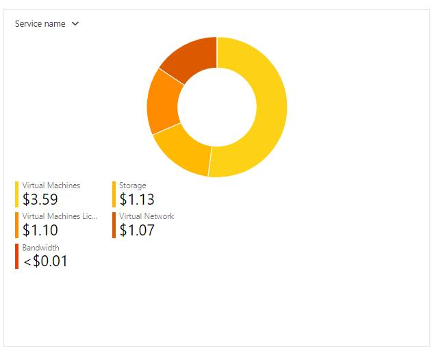
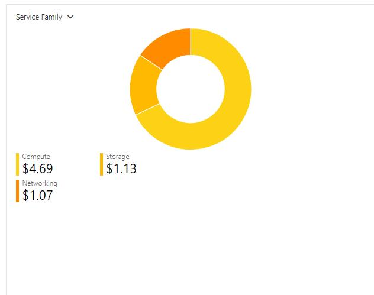
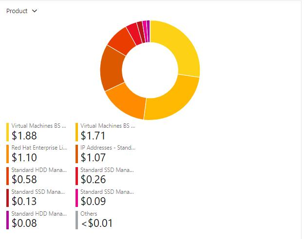
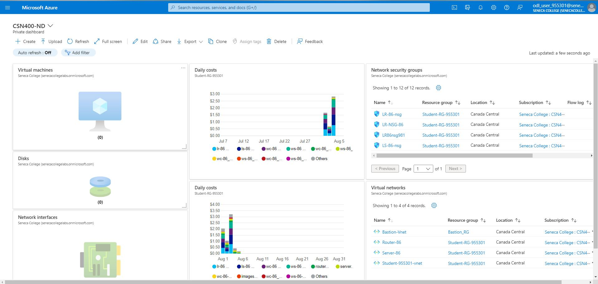

# Checkpoint10 Submission

- **COURSE IMFORMATION: CSN400-2234**
- **STUDENT'S NAME: Martin Yang**
- **STUDENT'S NUMBER: 152269205**
- **GITHUB USER_ID: 152269205-myseneca**
- **TEACHER'S NAME: Atoosa Nasiri**


### Table of Contents

1. [Part A - Route Table Updates](#part-a---route-table-updates)
2. [Part B - Port Forwarding Basic Connectivity](#part-b---port-forwarding-basic-connectivity)
3. [Part C - Logging & Isolating Masqueraded Packets](#part-c---logging--isolating-masqueraded-packets)
4. [Part D - Azure Cost Analysis Charts](#part-d---azure-cost-analysis-charts)


### Part A - Route Table Updates
>1.list all your Route Tables
```bash
myang111@DESKTOP-Q44JQBJ:/mnt/e/CSN400/CSN400-Capstone-Public/bash2$ az network route-table list --output table
[201~
DisableBgpRoutePropagation    Location       Name      ProvisioningState    ResourceGroup      ResourceGuid
----------------------------  -------------  --------  -------------------  -----------------  ------------------------------------
False                         canadacentral  RT-86     Succeeded            Student-RG-955301  1fda2bbe-9021-4f48-97c0-f27c0f58b74f
False                         canadacentral  RT-EX-86  Succeeded            Student-RG-955301  8a2dfea0-daa6-465e-a14d-37bee177761d
```
>2.list the routes in a specific Route Table
```bash
myang111@DESKTOP-Q44JQBJ:/mnt/e/CSN400/CSN400-Capstone$ az network route-table route list --resource-group Student-RG-955301 --route-table-name RT-86 -o table
AddressPrefix     HasBgpOverride    Name              NextHopIpAddress    NextHopType       ProvisioningState    ResourceGroup  
----------------  ----------------  ----------------  ------------------  ----------------  -------------------  -----------------
172.17.86.32/27   False             Route-to-Server   192.168.86.36       VirtualAppliance  Succeeded            Student-RG-955301
10.8.159.0/24     False             Route-to-Desktop  192.168.86.36       VirtualAppliance  Succeeded            Student-RG-955301
192.168.0.0/16    False             route-to-77       192.168.86.36       VirtualAppliance  Succeeded            Student-RG-955301
192.168.77.32/27  False             External-Router   192.168.86.36       VirtualAppliance  Succeeded            Student-RG-955301
```
```bash
myang111@DESKTOP-Q44JQBJ:/mnt/e/CSN400/CSN400-Capstone$ az network route-table route list --resource-group Student-RG-955301 --route-table-name RT-EX-86 -o table
AddressPrefix     HasBgpOverride    Name          NextHopIpAddress    NextHopType       ProvisioningState    ResourceGroup      
----------------  ----------------  ------------  ------------------  ----------------  -------------------  -----------------  
192.168.77.32/27  False             Route-to-Hub  192.168.99.36 
      VirtualAppliance  Succeeded            Student-RG-955301 
```
>3.list the subnets associated with a specific Route Table
```bash
myang111@DESKTOP-Q44JQBJ:/mnt/e/CSN400/CSN400-Capstone$ az network route-table show --name RT-86 --resource-group Student-RG-955301 --query "subnets[].id" --output table
Result
-----------------------------------------------------------------------------------------------------------------------------------------------------------------------------------
/subscriptions/e22a2bd0-d760-4866-9918-1c98f501eb6a/resourceGroups/Student-RG-955301/providers/Microsoft.Network/virtualNetworks/Server-86/subnets/SN1
/subscriptions/e22a2bd0-d760-4866-9918-1c98f501eb6a/resourceGroups/Student-RG-955301/providers/Microsoft.Network/virtualNetworks/Student-955301-vnet/subnets/Virtual-Desktop-Client
```
```bash
myang111@DESKTOP-Q44JQBJ:/mnt/e/CSN400/CSN400-Capstone$ az network route-table show --name RT-EX-86 --resource-group Student-RG-955301 --query "subnets[].id" --output table
Result
------------------------------------------------------------------------------------------------------------------------------------------------------
/subscriptions/e22a2bd0-d760-4866-9918-1c98f501eb6a/resourceGroups/Student-RG-955301/providers/Microsoft.Network/virtualNetworks/Router-86/subnets/SN1
```

### Part B - Port Forwarding Basic Connectivity

- [nat_basic-connectivity.sh](./content/nat_basic-connectivity.sh)
```bash
# to flush NAT tables


iptables -t nat -F


iptables -t nat -A POSTROUTING -o eth0 -j MASQUERADE

iptables -t nat -A PREROUTING -j LOG --log-prefix "PREROUTING: "

iptables -t nat -A POSTROUTING -j LOG --log-prefix "POSTROUTING: "

  # to allow other students to access APACHE server
iptables -t nat -A PREROUTING -p tcp --dport 1886 -j DNAT --to-destination 172.17.86.37:80

  # to allow other students to access MySQL server
iptables -t nat -A PREROUTING -p tcp --dport 1686 -j DNAT --to-destination 172.17.86.37:3306

  # to allow other students to access Linux server - SSH
iptables -t nat -A PREROUTING -p tcp --dport 1286 -j DNAT --to-destination 172.17.86.37:22

  # to allow other students to access IIS server
iptables -t nat -A PREROUTING -p tcp --dport 1986 -j DNAT --to-destination 172.17.86.36:80

  # to allow other students to access Windows server - RDP
iptables -t nat -A PREROUTING -p tcp --dport 1386 -j DNAT --to-destination 172.17.86.36:3389

```

/

- [firewalls-cp10.sh](./content/firewalls-cp10.sh)

### Part C - Logging & Isolating Masqueraded Packets


```bash
Aug  3 16:56:02 LR-86 kernel: IN=eth0 OUT=eth0 MAC=60:45:bd:5f:3a:0a:74:83:ef:d3:50:5d:08:00 SRC=192.168.77.36 DST=172.17.86.37 LEN=100 TOS=0x00 PREC=0x00 TTL=125 ID=11047 DF PROTO=TCP SPT=52818 DPT=22 WINDOW=2050 RES=0x00 ACK PSH URGP=0

Aug  3 16:56:26 LR-86 kernel: IN=eth0 OUT=eth0 MAC=60:45:bd:5f:3a:0a:74:83:ef:d3:50:5d:08:00 SRC=10.8.159.4 DST=172.17.86.36 LEN=40 TOS=0x00 PREC=0x00 TTL=127 ID=10876 DF PROTO=TCP SPT=50639 DPT=3389 WINDOW=0 RES=0x00 ACK RST URGP=0

Aug  3 16:56:51 LR-86 kernel: TO_DROP_FORWARDIN=eth0 OUT=eth0 MAC=60:45:bd:5f:3a:0a:74:83:ef:d3:50:5d:08:00 SRC=10.8.159.4 DST=192.168.77.36 LEN=52 TOS=0x00 PREC=0x00 TTL=127 ID=10889 DF PROTO=TCP SPT=50642 DPT=3306 WINDOW=64240 RES=0x00 SYN URGP=0

Aug  3 16:55:43 LR-86 kernel: IN=eth0 OUT=eth0 MAC=60:45:bd:5f:3a:0a:74:83:ef:d3:50:5d:08:00 SRC=192.168.77.36 DST=172.17.86.36 LEN=40 TOS=0x00 PREC=0x00 TTL=125 ID=11014 DF PROTO=TCP SPT=52809 DPT=80 WINDOW=2050 RES=0x00 ACK FIN URGP=0

Aug  3 16:55:43 LR-86 kernel: IN=eth0 OUT=eth0 MAC=60:45:bd:5f:3a:0a:74:83:ef:d3:50:5d:08:00 SRC=192.168.77.36 DST=172.17.86.37 LEN=40 TOS=0x00 PREC=0x00 TTL=125 ID=11017 DF PROTO=TCP SPT=52812 DPT=80 WINDOW=2047 RES=0x00 ACK URGP=0

```
1.

2.



/


### Part D - Azure Cost Analysis Charts

| No. | Scope | Chart Type | VIEW Type |  Date Range | Group By | Granularity| Example |
|-|-|-|-|-|-|-|-|
|1|Student-RG-955301| Column (Stacked) | DailyCosts | Last 7 Days | Resource | Daily |  |
|2|Student-RG-955301| Column (Stacked) | DailyCosts | Last 7 Days | Service | Daily |  |
|3|Student-RG-955301| Area| AccumulatedCosts | Last 7 Days | Resource | Accumulated |  |
|4|Student-RG-955301| Pie Chart | NA | Last Month | Service Name | NA |  |
|5|Student-RG-955301| Pie Chart | NA | Last Month | Service Family | NA |  |
|6|Student-RG-955301| Pie Chart | NA | Last Month | Product | NA |  |

### Customized Azure Dashboard

