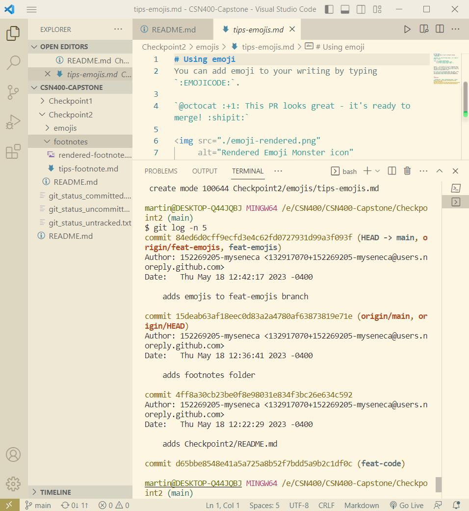

# This is my checkpoint2

#Checkpoint2 Submission

- **COURSE IMFORMATION: CSN400-2234**
- **STUDENT'S NAME: Martin Yang**
- **STUDENT'S NUMBER: 152269205**
- **GITHUB USER_ID: 152269205-myseneca**
- **TEACHER'S NAME: Atoosa Nasiri**

### Table of Contents
1. [Part A - Adding Files - Local Repo Workflow](#part-a---adding-files---local-repo-workflow)
2. [Part B - Inspecting Local Repo with \`git status\` and \`git log\`](#part-b---inspecting-local-repo-with-git-status-and-git-log)
3. [Part C - Creating & Merging Branches](#part-c---creating--merging-branches)
4. [Part D - Git Branching Strategy Review Question](#part-d---git-branching-strategy-review-question)

## Part A - Adding Files - Local Repo Workflow
1.[git_status_untracked.txt:](./git_status_untracked.txt)
```bash
On branch main
Your branch is up to date with 'origin/main'.

Changes not staged for commit:
  (use "git add <file>..." to update what will be committed)
  (use "git restore <file>..." to discard changes in working directory)
	modified:   Checkpoint2/README.md
Untracked files:

  (use "git add <file>..." to include in what will be committed)
	git_status_untracked.txt

no changes added to commit (use "git add" and/or "git commit -a")
```
2.[git_status_uncommitted.txt:](./git_status_uncommitted.txt)
```bash
On branch main
Your branch is up to date with 'origin/main'.

Changes to be committed:
  (use "git restore --staged <file>..." to unstage)
	modified:   Checkpoint2/README.md

Untracked files:
  (use "git add <file>..." to include in what will be committed)
	git_status_uncommitted.txt
	git_status_untracked.txt
```
3.[git_status_committed.txt:](./git_status_committed.txt)
```bash
On branch main
Your branch is ahead of 'origin/main' by 1 commit.
  (use "git push" to publish your local commits)

Untracked files:
  (use "git add <file>..." to include in what will be committed)
	git_status_committed.txt
	git_status_uncommitted.txt
	git_status_untracked.txt

nothing added to commit but untracked files present (use "git add" to track)
```


## Part B - Inspecting Local Repo with \`git status\` and \`git log\`
How do these two commands differ?

> A:"git status"shows the current state of the working directory and staging area, highlighting changes and pending modifications.
"git log" displays a log of commit history, allowing you to review the commits made in the repository.

Examples:
1.After creating the repository:

Running "git status" would display:
Untracked files:
  (use "git add <file>..." to include in what will be committed)

        example.txt

nothing added to commit but untracked files present (use "git add" to track)

2.After committing the changes:
Running git log would show the commit history:
commit abcd1234
Author: Your Name <your-email@example.com>
Date:   Tue May 18 10:00:00 2023 +0000

    Updated example.txt

commit efgh5678
Author: Your Name <your-email@example.com>
Date:   Mon May 17 09:00:00 2023 +0000


## Part C - Creating & Merging Branches
Run \`git log -n 5\`. Embed the log output as a bash script in the \`README.md\` file with proper formatting.

This is my created new branch:


This is my merged branch log:


```bash
commit 84ed6d0cff9ecfd3e4c62fd0727931d99a3f093f (HEAD -> 
main, origin/feat-emojis, feat-emojis)
Author: 152269205-myseneca <132917070+152269205-myseneca@users.noreply.github.com>
Date:   Thu May 18 12:42:17 2023 -0400

    adds emojis to feat-emojis branch

commit 15deab63af18eec0d83a2a4780af63873819e71e (origin/main, origin/HEAD)
Author: 152269205-myseneca <132917070+152269205-myseneca@users.noreply.github.com>
Date:   Thu May 18 12:36:41 2023 -0400

    adds footnotes folder

commit 4ff8a30cb23be0f8e98031e834f3bc26e634c592
Author: 152269205-myseneca <132917070+152269205-myseneca@users.noreply.github.com>
Date:   Thu May 18 12:22:29 2023 -0400

    adds Checkpoint2/README.md
```
## Part D - Git Branching Strategy Review Question

Q1:What are the differences between develop branch and main branch?
> A:The main branch is the default branch. It contains the latest release and is considered the mainline of development.
The develop branch works as an integration branch for ongoing development work. It is used to build and test the upcoming release and serves as a basis for collaboration and continuous integration.

Q2:What are the three supporting branches? Briefly describe the function of each of these supporting branches.
>A:1.Feature branches: These branches are created for developing new features or implementing specific changes. 
  2.Release branches: Release branches are created when the development team is preparing for a new release. They provide a stable environment for finalizing the release, performing bug fixes, and conducting testing. 
  3.Hotfix branches: Hotfix branches are used to address critical bugs or issues in the production environment. They are created from the main branch and directly merged back into the main branch once the fix is complete. 

  Q3:What are the best practices in working with release branches?
  > A:1.We should practice clear the naming, following a naming convention makes it easier to track and identify release branches.
    2.Then we can Create Release Branches from a Stable State to ensures that the release branch starts with a reliable codebase.
    3.We can Apply versioning and tagging to clearly identify and label each release, then Merge Back into Main Branch and Develop Branch to make sure that the changes made in the release branch are incorporated into the ongoing development.
    4.Kee the notes, add release notes to provide information to users, stakeholders, and other team members about the new features, improvements.
