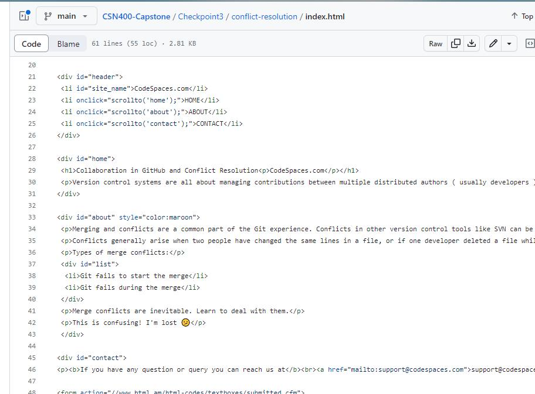

# Checkpoint3 Submission

- **COURSE IMFORMATION: CSN400-2234**
- **STUDENT'S NAME: Martin Yang**
- **STUDENT'S NUMBER: 152269205**
- **GITHUB USER_ID: 152269205-myseneca**
- **TEACHER'S NAME: Atoosa Nasiri**

### Table of Contents
1. [Part A - Manage Conflicts - Overwrite Remote Changes](#part-a---manage-conflicts---overwrite-remote-changes)
2. [Part B - Manage Conflicts - Reset Local Commit Head](#part-b---manage-conflicts---reset-local-commit-head)
3. [Part C - Manage Conflicts - Merge Editor](#part-c---manage-conflicts---merge-editor)
4. [Part D - Collaboration - Creating Pull Request](#part-d---collaboration---creating-pull-request)

## Part A - Manage Conflicts - Overwrite Remote Changes
Follow the instructions and submit all files, and embed logs when asked in your README.md. 

Q: What is the color of the text after you forcefully overwrite remote with local changes?
 The color is green after overwrite remote with local changes
 
part1-conflict-error:

```
To https://github.com/152269205-myseneca/CSN400-Capstone.git
 ! [rejected]        main -> main (fetch first)
error: failed to push some refs to 'https://github.com/152269205-meca/CSN400-Capstone.git'
hint: Updates were rejected because the remote contains work that 
do
hint: not have locally. This is usually caused by another repositoushing
hint: to the same ref. You may want to first integrate the remote ges
hint: (e.g., 'git pull ...') before pushing again.
hint: See the 'Note about fast-forwards' in 'git push --help' for ils.
```
part1-conflict-overwrite:
```
Enumerating objects: 25, done.
Counting objects: 100% (25/25), done.
Delta compression using up to 8 threads
Compressing objects: 100% (21/21), done.
Writing objects: 100% (22/22), 201.43 KiB | 9.59 MiB/s, done.
Total 22 (delta 7), reused 0 (delta 0), pack-reused 0
remote: Resolving deltas: 100% (7/7), completed with 1 local object.  
To https://github.com/152269205-myseneca/CSN400-Capstone.git
 + 2557ae3...b02a9a8 main -> main (forced update)
```


## Part B - Manage Conflicts - Reset Local Commit Head
Follow the instructions and submit all files, and embed logs when asked in your README.md.
Q:What is the color of the text after you forcefully overwrite remote with local changes?
   The color is green after overwrite remote with local changes.

part2-conflict-error:
```
Pushing to https://github.com/152269205-myseneca/CSN400-Capstone.git
To https://github.com/152269205-myseneca/CSN400-Capstone.git
 ! [rejected]        main -> main (fetch first)
error: failed to push some refs to 'https://github.com/152269205-myseneca/CSN400-Capstone.git'
hint: Updates were rejected because the remote contains work that you do
hint: not have locally. This is usually caused by another repository pushing
hint: to the same ref. You may want to first integrate the remote changes
hint: (e.g., 'git pull ...') before pushing again.
hint: See the 'Note about fast-forwards' in 'git push --help' for details.
```
part2-pull-error:

```
error: Pulling is not possible because you have unmerged files.
hint: Fix them up in the work tree, and then use 'git add/rm <file>'
hint: as appropriate to mark resolution and make a commit.
fatal: Exiting because of an unresolved conflict.
 ```
  
part2-reset-head:
```
  HEAD is now at b02a9a8 modifies style color in index.html to green
commit 9c9a92f1e81b3bbace5ba6d147f7faf4eb4151f7
Author: 152269205-myseneca <132917070+152269205-myseneca@users.noreply.github.com>
Date:   Thu May 25 10:52:56 2023 -0400

    adds conflict-resolution folder
```

## Part C - Manage Conflicts - Merge Editor

  part3-pull-conflict:
```
  POST git-upload-pack (375 bytes)
From https://github.com/152269205-myseneca/CSN400-Capstone
 * branch            feat-body-text -> FETCH_HEAD
 = [up to date]      feat-body-text -> origin/feat-body-text
Auto-merging Checkpoint3/conflict-resolution/index.html
CONFLICT (content): Merge conflict in Checkpoint3/conflict-resolution/index.html
Automatic merge failed; fix conflicts and then commit the result.
```
  
  part3-status:
```
  On branch main
Your branch is up to date with 'origin/main'.

All conflicts fixed but you are still merging.
  (use "git commit" to conclude merge)

Changes to be committed:
	modified:   Checkpoint3/conflict-resolution/index.html

Untracked files:
  (use "git add <file>..." to include in what will be committed)
	Checkpoint3/logs/part3-pull-conflict.log
	Checkpoint3/logs/part3-status.log
```
  
  This is the screenshot of my paragraphs

  
## Part D - Collaboration - Creating Pull Request
  
  Pull request summary:
  This is the screenshot of my pull request


