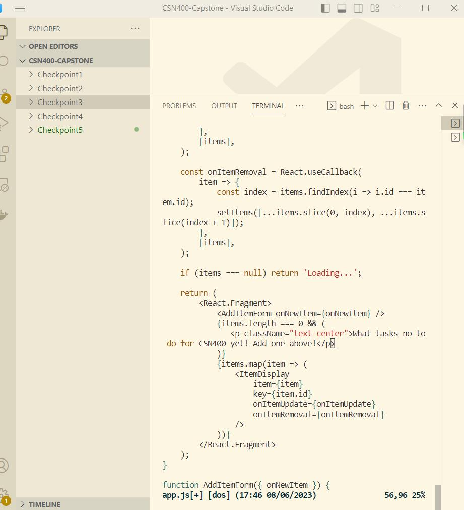
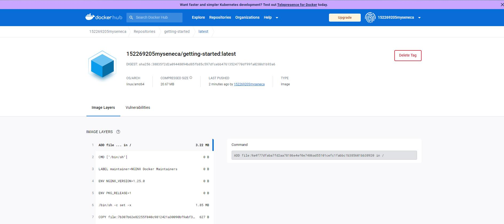
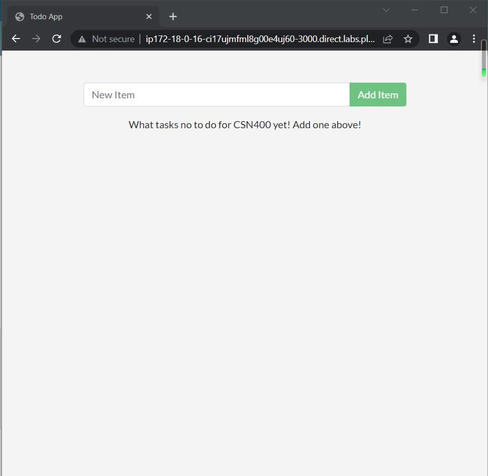

# Checkpoint5 Submission

- **COURSE IMFORMATION: CSN400-2234**
- **STUDENT'S NAME: Martin Yang**
- **STUDENT'S NUMBER: 152269205**
- **GITHUB USER_ID: 152269205-myseneca**
- **TEACHER'S NAME: Atoosa Nasiri**

## Table of Contents
1. [Part A - Containerize an application](#part-a---containerize-an-application)
2. [Part B - Share the application](#part-b---share-the-application)
3. [Part C - Persist the DB](#part-c---persist-the-db)
4. [Part D - Multi container apps](#part-d---multi-container-apps)

## Part A - Containerize an application
Follow the instructions and answer all questions.
```
Question1: If you run docker build -t getting-started . for a second time, the build time will be different from first time, why? Why the number of steps are also different? Explain your answers in detail. 
```

> A: Because it is my first time to use this command to build a new container image. I can see that Docker downloaded a lot of “layers”. This is because I instructed the builder that you wanted to start from the node:18-alpine image. But, since I didn’t have that on your machine, Docker needed to download the image. But the second time was faster, since I have installed thoes image already.And also for the steps, if a particular instruction and its dependencies haven't changed, Docker will reuse the cached layer and skip executing that step.

```
Question2: What does -t flag do? If you do not use it what is the error? embed the error in your answer.
```
> A:The -t flag command is used to specify a tag for the Docker image being built. The tag allows you to give a meaningful and identifiable name to the image. If I don't provide the -t flag with a tag name, Docker will throw an error indicating that the tag is missing. For example on the previous command: 
```bash
ERROR: "docker buildx build" requires exactly 1 argument.
See 'docker buildx build --help'.
```


```
Question3: Run docker build -t getting-started . a few times and then run docker image ls to get the list of your images, why do you still one image listed even though you have tried building image many times?
```

> A: Because Docker only retains the most recent image for that tag, discarding the previous ones. If I run the command again, I will only see the least image.

```
Question4: What are -d and -p flags? What does each flag do? Start another git bah or wsl terminal and run docker run -p 1000:3000 getting-startedin it, Notice that -d is missing. What is the output?Embed it in your submission. Explain why this happened?
```

> A: -d flag to run the new container in “detached” mode (in the background). I also use the -p flag to create a mapping between the host’s port 3000 to the container’s port 3000. Without the port mapping, you wouldn’t be able to access the application.

> When I run this command without -d, it gave me error like this :

```bash
docker run -p 1000:3000 getting-started
Using sqlite database at /etc/todos/todo.db
Listening on port 3000
```
>It shows that my container has started successfully, and I can see the information about the database location and the port on which the application is listening.

```
Question5: The previous question has created a new container with your app running in it. Which port in localhost must be used to reach it?
```
> A: I should use port 1000, http://localhost:1000 to reach it.

```
Question6: Run docker ps and embed the output in your answer. If you have completed previous questions, you should have at least two containers running in your system. What is their difference? Can you explain how and why this was necessary?
```
```bash
 A:CONTAINER ID   IMAGE             COMMAND                   CREATED          STATUS          PORTS                            NAMES
   53b93d03bd3d   getting-started   "docker-entrypoint.s…"   4 minutes ago    Up 16 seconds   0.0.0.0:1000->3000/tcp   recursing_mahavira
   a713bab16e49   getting-started   "docker-entrypoint.s…"   23 minutes ago   Up 23 minutes   0.0.0.0:3000->3000/tcp   vibrant_bhaskara
```

> The containers have different port mappings. Container 1 maps port 3000 of the container to port 1000 on the host machine.
Running multiple containers based on the same image provides flexibility, scalability, and resilience. It allows for efficient resource utilization, high availability, and improved performance.

```
Question7: How long did it take to create the image after you updated the code? It is still shorter than the first time you did it, why?
```
> A: I felt this time it takes longer than any time before, it seems like udated everything, The reason is that if the modification in the app.js file is near the end of the Dockerfile, Docker will need to redo all the preceding steps in the Dockerfile as well, even if they haven't changed. This can contribute to a longer build time.

```
Question8: What is the error message you get when you try to run the app container? Embed the error in your submission and explain why do you get this error at all?
```

>A:
```bash
f4172b65807f17fc5bd2b321ecf3916547773e83c873954630861019271c1721
docker: Error response from daemon: driver failed programming external connectivity on endpoint modest_hertz (9af42a9362e7634f9f6e76a1720c09f2af32e9505810c7eaafb930bb22f7aba8): Bind for 0.0.0.0:3000 failed: port is already allocated.
````
> The error occurred because you aren’t able to start the new container while your old container is still running. The reason is that the old container is already using the host’s port 3000 and only one process on the machine can listen to a specific port.

```
Question9: Repeat all the step for app update for: <p className="text-center">What tasks no to do for CSN400 yet! Add one above!</p> and embed a screenshot of your app in your submission.
```

> This is the screenshot of PartA-Question 9




## Part B - Share the application
> This is the screenshot of PartB-Push



> This is the screenshot of PartB-share the app



## Part C - Persist the DB
Follow the instructions and embed outputs of the commands asked for.
> [This is the output of tododb](./screenshotsandfiles/todo-db.txt)
```bash
[
    {
        "CreatedAt": "2023-06-09T02:07:43Z",
        "Driver": "local",
        "Labels": null,
        "Mountpoint": "/var/lib/docker/volumes/todo-db/_data",
        "Name": "todo-db",
        "Options": null,
        "Scope": "local"
    }
]
```
## Part D - Multi container apps

[This is the output of dig-mysql](./screenshotsandfiles/dig-mysql.txt)
```bash
05757b6a94c1 >~  dig mysql

; <<>> DiG 9.18.13 <<>> mysql
;; global options: +cmd
;; Got answer:
;; ->>HEADER<<- opcode: QUERY, status: NOERROR, id: 37663
;; flags: qr rd ra; QUERY: 1, ANSWER: 1, AUTHORITY: 0, ADDITIONAL: 0

;; QUESTION SECTION:
;mysql.                         IN      A

;; ANSWER SECTION:
mysql.                  600     IN      A       172.18.0.3

;; Query time: 0 msec
;; SERVER: 127.0.0.11#53(127.0.0.11) (UDP)
;; WHEN: Fri Jun 09 02:39:37 UTC 2023
;; MSG SIZE  rcvd: 44
```

[This is my show-databases output](./screenshotsandfiles/show-databases.txt)
```bash
mysql> SHOW DATABASES;
+--------------------+
| Database           |
+--------------------+
| information_schema |
| mysql              |
| performance_schema |
| sys                |
| todos              |
+--------------------+
5 rows in set (0.00 sec)
```
[This is my select-from-todos output](./screenshotsandfiles/select-from-todos.txt)
```bash
mysql> select * from todo_items;
+--------------------------------------+-------------+-----------+
| id                                   | name        | completed |
+--------------------------------------+-------------+-----------+
| 5a5214a6-8235-4466-96e8-ed9f4b2adabc | add new     |         0 |
| 967bd15e-d1bc-43db-a55b-5dcac54cbf34 | this is new |         0 |
+--------------------------------------+-------------+-----------+
2 rows in set (0.00 sec)
```