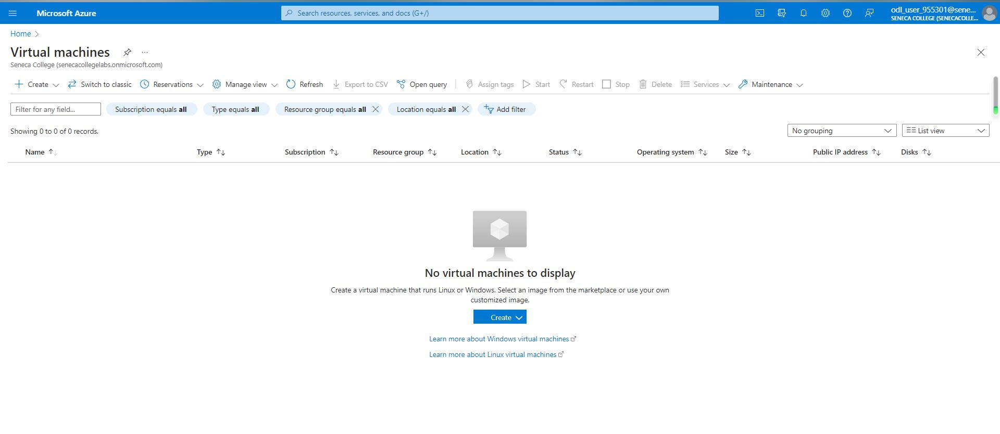
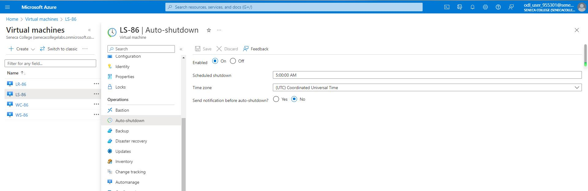

# Checkpoint6 Submission

- **COURSE IMFORMATION: CSN400-2234**
- **STUDENT'S NAME: Martin Yang**
- **STUDENT'S NUMBER: 152269205**
- **GITHUB USER_ID: 152269205-myseneca**
- **TEACHER'S NAME: Atoosa Nasiri**

## Table of Contents
- [Part A - Creating Network Resources using Azure CLI](#part-a---creating-network-resources-using-azure-cli)
- [Part B - Working in Azure CLI Bash](#part-b---working-in-azure-cli-bash)
- [Part C - Network Review Questions](#part-c---network-review-questions)
- [Part D - Creating Virtual Machines](#part-d---creating-virtual-machines)

## Part A - Creating Network Resources using Azure CLI

The updated lines in the network_config.sh file:
```bash
RG_NAME="Student-RG-955301"     # your student group
LOCATION="canadacentral"    # your location
ID="86"          #unique ID assigned to you

Student_vnet_name="Student-955301-vnet"
Student_vnet_address="10.8.159.0/24"
Client_Subnet_name="Virtual-Desktop-Client"
Client_Subnet_address="10.23.205.0/24"
```
Answer below questions:

1.In network_config_test.sh what does if [[ ! $(az group list -o tsv --query "[?name=='$RG_NAME']") ]] do? Explain your answer.
>The line if [[ ! $(az group list -o tsv --query "[?name=='$RG_NAME']") ]] in the network_config_test.sh script is used to check if an Azure resource group with the specified name ($RG_NAME) exists or not.
>--query "[?name=='$RG_NAME']": This query expression filters the list of resource groups based on the condition name == $RG_NAME. It checks if there is any resource group with a name that matches the value of the $RG_NAME variable.

2.Why is it crucial to check if a resource exist before creating it? What bash syntax do you use to test this? How do you check if a vnet exits in vnet_create.sh?
>It helps us to avoid conflicts and errors, also preventing duplication and overwriting.
>We can use the "if" statements to check if a resources exists.
>We can use this command to check id a vnet exists in vnet_create.sh: if [[ ! $(az network vnet show -g $RG_NAME -n $VNET_NAME -o tsv --query id) ]];


3.What is the Azure CLI command to create vnet? Give the specific command as per your environment and unique ID configuration. What are the required and what are the optional parameters that you need to pass to it?

>This is the command:az network vnet create --name "Student-955301-vnet" or Router-86 or Server-86 --resource-group "Student-RG-955301" 
>It required the <vnet_name>,<resource_group_name>,and the optional will be subnet-name, subnet-prefix,location, tags.


4.What is the Azure CLI command to create subnet? Give the specific command as per your environment and unique ID configuration. What are the required and what are the optional parameters that you need to pass to it?

>This is the command:az network vnet subnet create --name SN1 or SN2 --vnet-name "Student-955301-vnet" or Router-86 or Server-86 --resource-group "Student-RG-955301" 
>It required the <vnet_name>,<subnet_name>, <resource_group_name>,and the optional can be route-table, service-endpoints, private-endpoint-network-policies.


## Part B - Working in Azure CLI Bash

Links to all files I created in this part:
- [vnet_list.json](./bash-scripts/vnet_list.json)
- [student_vnet.json](./bash-scripts/student_vnet.json)
- [peerings.tbl](./bash-scripts/peerings.tbl)
```bash
AllowForwardedTraffic    AllowGatewayTransit    AllowVirtualNetworkAccess    DoNotVerifyRemoteGateways    Name                   PeeringState    PeeringSyncLevel    ProvisioningState    ResourceGroup      ResourceGuid                          UseRemoteGateways
-----------------------  ---------------------  ---------------------------  ---------------------------  ---------------------  --------------  ------------------  -------------------  -----------------  ------------------------------------  -------------------
True                     False                  True                         False                        Student-Bastion955301  Connected       FullyInSync         Succeeded            Student-RG-955301  2e0a984b-9a2e-0f6e-3de7-7624bfbb14dc  False
True                     False                  True                         False                        StudenttoRouter        Connected       FullyInSync         Succeeded            Student-RG-955301  2638b3bc-8d90-0c92-2240-d729fd403494  False
```

Details of my Router-86 subnet SN1 using az show command in json format and query it for details of subnet and rout associations. 
```bash
{
  "RouteAssociations": null,
  "Subnet": null
}    
```

- [route_list.tbl](./bash-scripts/route_list.tbl)
```bash
AddressPrefix    HasBgpOverride    Name              NextHopIpAddress    NextHopType       ProvisioningState    ResourceGroup
---------------  ----------------  ----------------  ------------------  ----------------  -------------------  -----------------
172.17.86.32/27  False             Route-to-Server   192.168.86.36       VirtualAppliance  Succeeded            Student-RG-955301
10.23.205.0/24   False             Route-to-Desktop  192.168.86.36       VirtualAppliance  Succeeded            Student-RG-955301
```

- [route_details.json](./bash-scripts/route_details.json)

What CLI command will show you which subnet is associated to which route in route table? 
>This code will work for that:
```bash
az network vnet subnet show --name <subnet_name> --vnet-name <vnet_name> --resource-group <resource_group_name> --route-table <route_table_name>
```
## Part C - Network Review Questions

1.What is Azure Virtual Network (VNET)? Elaborate in your own words, you may use diagrams if drawn by yourself.
>VNET is a net construct in Azure and it will connect to my Azure resources.It works like a data center, I can manage my own resources and control the network environment, as well as deploy resources.

2.In the context of Hybrid Cloud architecture. How on-prem computers can access resources inside Azure virtual network?
>They are several methods we can use to enable on-premises pcs to access resources, like we can use azure bastion  to access our virtual machines within the Azure VNet securely and we don't need a public IP address or a VPN connection.
>The other way is Virtual Network Gateway,we can establish a site-to-site VPN connection between your on-premises network and the Azure VNet, it providing the cinnection like a bridge.

3.What are the most important benefits of Azure Virtual Networks? Elaborate in your own words. Do not copy/paste from Azure Documentation. Itemized list of just benefit without proper elaboration will not receive any marks
>a:Azure Virtual Networks provide a secure options to connect our resources with on-premises networks.We can build a VPN to create a secured connections between the networks, that keeps safe between pcs and our cloud resources.
>b.It giving us different ip address ranges and we can also define our ranges and subnets, which is providing us more flexibilities of managing our networks.
>c.Azure Virtual Networks also support various traffic routing and load balancing services, we can modifier the configration of the network flow within the vnet, also load balancing service distribute the comming traffic across different resources.

4.What is the difference between Network Security Group (NSG) and Route-Tables?
What is the difference between NSG and Firewalls?
>NSG and Route table, they both are very important part of Azure, NSG provides granular control over inbound and outbound network traffic, usually focuses on network security by filtering and controlling network traffic at the IP address and port level.
>A Route Table controls the routing of network traffic within a virtual network, it handles the routing of network traffic within a virtual network.
>Firewall is a cloud-based network security service, It operates at the application layer and more advanced security features compared to NSGs. It provides application-level security and centralized management of security policies.

5.What is a hob-and-spoc network topology and how be deployed in Azure Cloud?
>It is a networking design where all traffic flows through a central hub, in this kind topology, the hub acts as a central point of connectivity,to deploy a  hob-and-spoc, we need to create hub vnet to make new gateways, firewalls, and more network appliances, then we need to create separate VNets for each of the spokes. Then we can use azure peering to establish the connectivity and we can also configure the network security group to control the flow traffic.

6.In working with Azure VNETs, do you need o to define gateways for Azure to route traffic between subnets?
>In Azure VNETs, we don't need to define gateways for Azure to route traffic between subnets. Azure automatically routes traffic between subnets within the same VNET without extra configuration.

7.When do you need to configure and use Virtual Network Gateways?
>a.When I have multiple Azure VNETs and I want to establish connectivity between them, then I can configure a VNET-to-VNET VPN. Because VNG is used to create the VPN tunnels, and enabling communication between different VNETs.
>b.When I want to establish a secure connection between my VNET and an on-premises network, I need to configure a Site-to-Site VPN to allows resources in my VNET to connect with resources in your on-premises network.

## Part D - Creating Virtual Machines
- [vm_list.tbl](./bash-scripts/vm_list.tbl)
The command I used is : 
```
az vm list --output table
```
```bash
Name    ResourceGroup      Location       Zones
------  -----------------  -------------  -------
LR-86   STUDENT-RG-955301  canadacentral
LS-86   STUDENT-RG-955301  canadacentral
WC-86   STUDENT-RG-955301  canadacentral
WS-86   STUDENT-RG-955301  canadacentral
```

- [WC-99-details.json](./bash-scripts/WC-99-details.json)
The command I used is:
```
az vm show --name WC-86 --resource-group STUDENT-RG-955301 --output json
```
- [nsg_list.tbl](./bash-scripts/nsg_list.tbl)
```bash
Location       Name       ProvisioningState    ResourceGroup      ResourceGuid
-------------  ---------  -------------------  -----------------  ------------------------------------
canadacentral  LR-NSG-86  Succeeded            Student-RG-955301  18fe8111-9d47-471c-bd6e-3cf5678fd2a4
canadacentral  LS-NSG-86  Succeeded            Student-RG-955301  3a7cb027-c86f-4773-a98b-74093347f1bc
canadacentral  WC-NSG-86  Succeeded            Student-RG-955301  64d4010e-517a-49e4-8c03-802e4bc00e7b
canadacentral  WS-NSG-86  Succeeded            Student-RG-955301  edaa0585-0aa8-4845-a897-07f148632f19
```
Q4.I used:
```
az vm list --output table
```
>I can see after deleting all the VMs, it disapeared from the output list one by one. I also checked the Azure portal to see if they are still there.

This is the screenshot of deleting the VMs




Q5:
 This is the screenshot of auto shutdown configuration



>Time zone is UTC, the correct timezone will be canadacentral.

