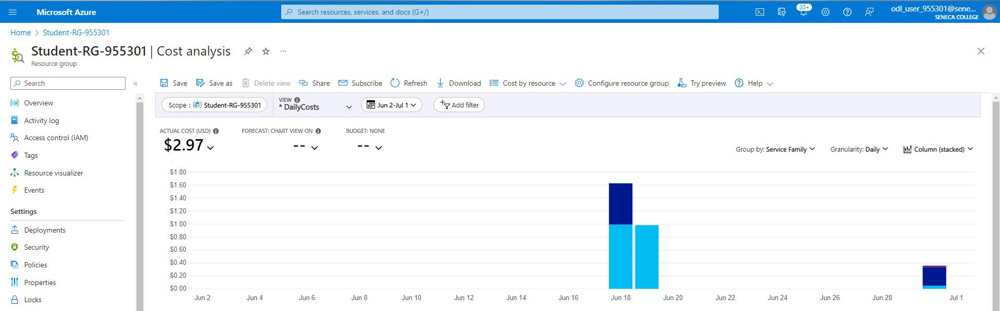
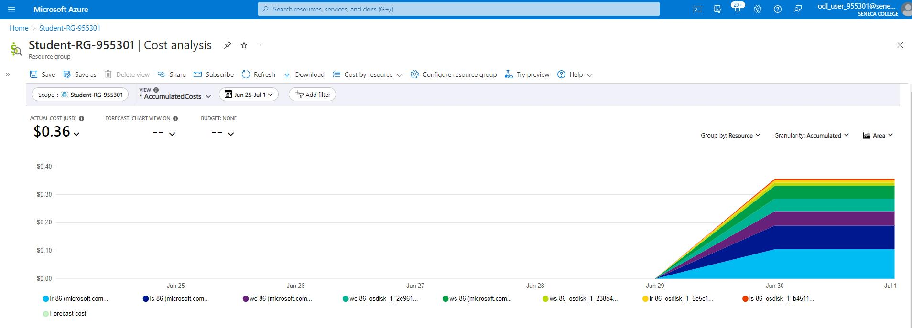
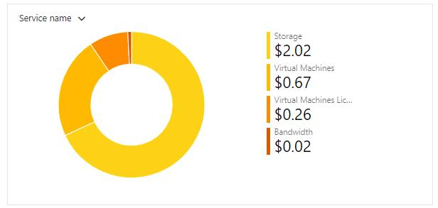
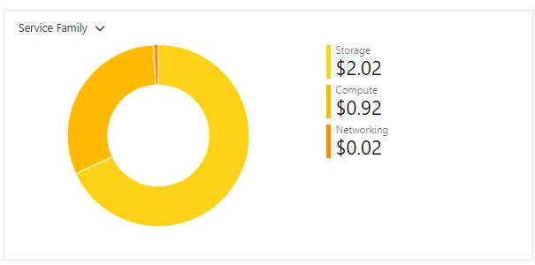
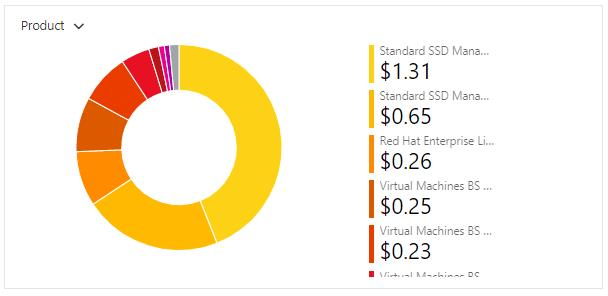
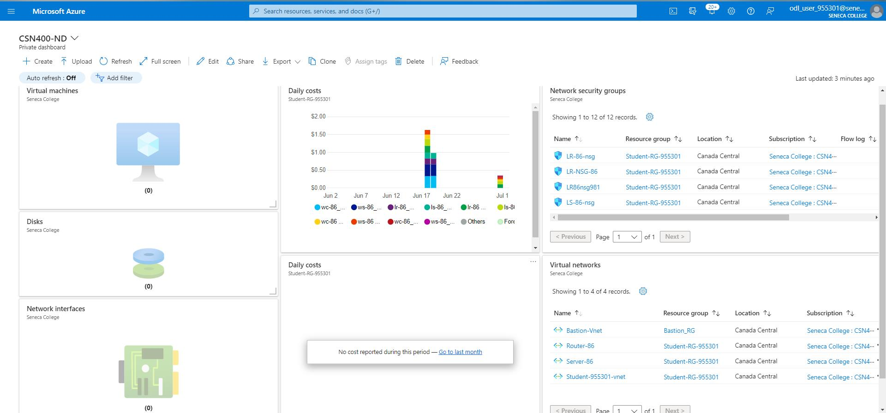

# Checkpoint7 Submission

- **COURSE IMFORMATION: CSN400-2234**
- **STUDENT'S NAME: Martin Yang**
- **STUDENT'S NUMBER: 152269205**
- **GITHUB USER_ID: 152269205-myseneca**
- **TEACHER'S NAME: Atoosa Nasiri**

# Table of Contents

1. [Part A - Creating & Configuring VMs - Using Portal](#part-a---creating--configuring-vms---using-portal)
2. [Part B - Enable IP_Forwarding - Using Portal](#part-b---enable-ip_forwarding---using-portal)
3. [Part C - Basic Connectivity - VM Configuration](#part-c---basic-connectivity---vm-configuration)
4. [Part D - Creating & Configuring VM Images - Using Portal](#part-d---creating--configuring-vm-images---using-portal)
5. [Part E - Azure Cost Analysis Charts](#part-e---azure-cost-analysis-charts)
6. [Part F - Create Customized Azure Dashboard](#part-f---create-customized-azure-dashboard)

# Part A - Creating & Configuring VMs - Using Portal

1.What is the difference between Windows machine NSG and Linux machine NSG rules? Why? Do not give screenshots just describe the difference? Do you need a rule for ssh or rdp? What happens if you delete specific ssh and rdp rules?

>A：Windows machine NSG rules focus on network protocols and ports necessary for Windows services, and the Linux machine NSG more focus on the connection ports associated with services like SSH. Because Windows machines  require specific network protocols and ports for services like RDP, but Linux machines have different network protocols and ports associated with their services.
>Yes,for ssh, we need  a rule that allows traffic on port22, and rdp, we need 3389. 
>If I delete the ssh rule, then I will be locked by this specific port.


2.Work from Azure Bash CLI in Portal to get a list of your VM, NSG, NIC, and Disks. You can start with the below commands. Make sure the outputs in table format are embedded in your submission.


## get the resource group list
```bash
az group list -out table

Name               Location       Status
-----------------  -------------  ---------
Bastion_RG         canadacentral  Succeeded
Student-RG-955301  canadacentral  Succeeded
NetworkWatcherRG   canadaeast     Succeeded
```
## crate a variable with your student resource group to make your job easier!
```bash
RG="Student-RG-955301"
```

## get a list of your VM, NSG, NIC, Disks
```bash
az vm list -g $RG -o table
Name    ResourceGroup      Location       Zones
------  -----------------  -------------  -------
LR-86   Student-RG-955301  canadacentral
LS-86   Student-RG-955301  canadacentral
WC-86   Student-RG-955301  canadacentral
WS-86   Student-RG-955301  canadacentral
```
```bash
az network nic list -g $RG -o table

EnableAcceleratedNetworking    EnableIPForwarding    Location       MacAddress         Name      NicType    Primary    ProvisioningState    ResourceGroup      ResourceGuid     
                     VnetEncryptionSupported
-----------------------------  --------------------  -------------  -----------------  --------  ---------  ---------  -------------------  -----------------  ------------------------------------  -------------------------
False                          False                 canadacentral  00-0D-3A-E9-B2-14  lr-86665  Standard   True       Succeeded            Student-RG-955301  d28a7024-2acc-4e05-ba86-0123ed9c892e  False
False                          False                 canadacentral  60-45-BD-5F-73-DF  ls-86360  Standard   True       Succeeded            Student-RG-955301  d1951d3c-fe33-4c08-b810-4c2689a75da2  False
False                          False                 canadacentral  00-22-48-AF-3B-E6  wc-86339  Standard   True       Succeeded            Student-RG-955301  eb81a5f3-4d30-424a-bed7-a431b1e4cdf7  False
False                          False                 canadacentral  60-45-BD-60-B6-CD  ws-86668  Standard   True       Succeeded            Student-RG-955301  040d3a62-33a3-4b4d-959f-0c2e0f6b7066  False
```
```bash
>az network nsg list -g $RG -o table

Location       Name       ProvisioningState    ResourceGroup      ResourceGuid
-------------  ---------  -------------------  -----------------  ------------------------------------
canadacentral  LR-86-nsg  Succeeded            Student-RG-955301  5c675514-8ef8-4fef-a70f-2aba2df28121
canadacentral  LR-NSG-86  Succeeded            Student-RG-955301  18fe8111-9d47-471c-bd6e-3cf5678fd2a4
canadacentral  LS-86-nsg  Succeeded            Student-RG-955301  67ecbe55-1adf-43c9-925c-f07a5c919ce6
canadacentral  LS-NSG-86  Succeeded            Student-RG-955301  3a7cb027-c86f-4773-a98b-74093347f1bc
canadacentral  WC-86-nsg  Succeeded            Student-RG-955301  04eae9a0-7400-46c4-9a13-f3fb85e35168
canadacentral  WC-NSG-86  Succeeded            Student-RG-955301  64d4010e-517a-49e4-8c03-802e4bc00e7b
canadacentral  WS-86-nsg  Succeeded            Student-RG-955301  e02670c0-8dda-4c1b-a45b-79a84238028c
canadacentral  WS-NSG-86  Succeeded            Student-RG-955301  edaa0585-0aa8-4845-a897-07f148632f19
```
```bash
az disk list -g $RG -o table

Name                                             ResourceGroup      Location       Zones    Sku           OsType    SizeGb    ProvisioningState
-----------------------------------------------  -----------------  -------------  -------  ------------  --------  --------  -------------------
LR-86_OsDisk_1_5e5c1573700d427a82b50a307896bcc2  Student-RG-955301  canadacentral       
    Standard_LRS  Linux     64        Succeeded
LS-86_OsDisk_1_b4511208a2504d03a79a91baa7f4b608  Student-RG-955301  canadacentral       
    Standard_LRS  Linux     64        Succeeded
WC-86_OsDisk_1_2e961727ad9a491aa98463b20e1fa719  Student-RG-955301  canadacentral       
    Standard_LRS  Windows   127       Succeeded
WS-86_OsDisk_1_238e470aee3c4f08aca8a49e86bca00a  Student-RG-955301  canadacentral       
    Standard_LRS  Windows   127       Succeeded
```

# Part B - Enable IP_Forwarding - Using Portal

1.Check the status of ip-forwarding using the command az network nic ip-config show with output format as json. Include only the command not output including the --quey you used in your submission.

>A: az network nic show --name lr-86475 -g Student-RG-955301 --query "enableIPForwarding" -o json

2.When your output format is json, which property shows the status of the ip-forwarding attribute? Embed only the property that shows the status of ip-forwarding.

>A:It shows "True" for the status

3.Check if the IP forwarding in NIC is enabled using Azure bash. 👉 Hint: az network nic show -g <rg-name> -n <nic-name> --query "enableIpForwarding"

>A: Yes, the IP forwarding in NIC is enabled when I used Azure bash to check.

# Part C - Basic Connectivity - VM Configuration

1.In configuring your Linux VMs, for the step "Remove the firewalld service", which command will you be using?

>sudo yum remove firewalld


2.In configuring your Linux VMs, what command do you use to check the status of iptabels?

>sudo systemctl status iptables


3.How can you make iptables service start automatically after reboot on CenOS/RHEL8? 👉 Hint: RHEL7: How to disable Firewalld and use Iptables instead

 >sudo systemctl enable iptables


4.Run a command in LR-xx that shows all iptables chains with their order number. What is the default setting? Include both the command and its output in your submission. How could you improve these settings to be less vulnerable to attacks?
```bash
sudo iptables -L --line-numbers
Chain INPUT (policy ACCEPT)
num  target     prot opt source               destination
1    ACCEPT     all  --  anywhere             anywhere             state RELATED,ESTABLISHED
2    ACCEPT     icmp --  anywhere             anywhere
3    ACCEPT     all  --  anywhere             anywhere
4    ACCEPT     tcp  --  anywhere             anywhere             state NEW tcp dpt:ssh
5    REJECT     all  --  anywhere             anywhere             reject-with icmp-host-prohibited

Chain FORWARD (policy ACCEPT)
num  target     prot opt source               destination
1    REJECT     all  --  anywhere             anywhere             reject-with icmp-host-prohibited

Chain OUTPUT (policy ACCEPT)
num  target     prot opt source               destination
```

>A:Default setting is like this : 
```bash
Chain INPUT/FORWARD/OUTPUT (policy ACCEPT)
num  target     prot opt source               destination
```
>A: To make it  less vulnerable to attacks, we can 1.make rules for the specific traffic port. 2.Limit the connection attempts.
>3.Update regularly.


5.Run a command that shows the hostname in LR-XX and LX-XX. Embed the output in your submission.
```bash
 Static hostname: LR-86.CSN4002234.com
         Icon name: computer-vm
           Chassis: vm
        Machine ID: 453c95589ac44adfa31654d4a34fb87f
           Boot ID: 5c494cf030aa4f658761706df6a7b6ed
    Virtualization: microsoft
  Operating System: Red Hat Enterprise Linux 8.7 (Ootpa)
       CPE OS Name: cpe:/o:redhat:enterprise_linux:8::baseos
            Kernel: Linux 4.18.0-425.13.1.el8_7.x86_64
      Architecture: x86-64
```
```bash
 Static hostname: LS-86.CSN4002234
         Icon name: computer-vm
           Chassis: vm
        Machine ID: 453c95589ac44adfa31654d4a34fb87f
           Boot ID: 3d203d58592a4967b27f5648e24006b3
    Virtualization: microsoft
  Operating System: Red Hat Enterprise Linux 8.7 (Ootpa)
       CPE OS Name: cpe:/o:redhat:enterprise_linux:8::baseos
            Kernel: Linux 4.18.0-425.13.1.el8_7.x86_64
      Architecture: x86-64
```
# Part D - Creating & Configuring VM Images - Using Portal

1.Run a command in CLI that lists all your Custom Images. Hint: az image list .... Change the output format to table format and embed the answer in your submission.
```bash
HyperVGeneration    Location       Name             ProvisioningState    ResourceGroup
------------------  -------------  ---------------  -------------------  -----------------
V2                  canadacentral  lr-86-ver-0.0.1  Succeeded            STUDENT-RG-955301
V2                  canadacentral  ls-86-ver-0.0.1  Succeeded            STUDENT-RG-955301
V2                  canadacentral  wc-86-ver-0.0.1  Succeeded            STUDENT-RG-955301
V2                  canadacentral  ws-86-ver-0.0.1  Succeeded            STUDENT-RG-955301
```
2.Delete your VMs after your work is completed. Run a command in CLI that lists all your VMs. Hint: az vm list .... Change the output format to table format and embed the answer in your submission.
>Since all the vms have been deleted
```bash
Name  ResourceGroup  PowerState  Location
----- -------------- ----------- -----------
```

3.Recreate all VMs from your images, and establish basic connectivity. How long the entire process took? How can you do this more efficiently?

>A:This way is faster compared to creating new VMs from scratch since the base OS and software configurations are already included in the image.

# Part E - Azure Cost Analysis Charts

| No. | Scope | Chart Type | VIEW Type |  Date Range | Group By | Granularity| Example |
|-|-|-|-|-|-|-|-|
|1|Student-RG-955301| Column (Stacked) | DailyCosts | Last 7 Days | Resource | Daily |  |
|2|Student-RG-955301| Column (Stacked) | DailyCosts | Last 7 Days | Service | Daily |  |
|3|Student-RG-955301| Area| AccumulatedCosts | Last 7 Days | Resource | Accumulated |  |
|4|Student-RG-955301| Pie Chart | NA | Last Month | Service Name | NA |  |
|5|Student-RG-955301| Pie Chart | NA | Last Month | Service Family | NA |  |
|6|Student-RG-955301| Pie Chart | NA | Last Month | Product | NA |  |


# Part F - Create Customized Azure Dashboard

