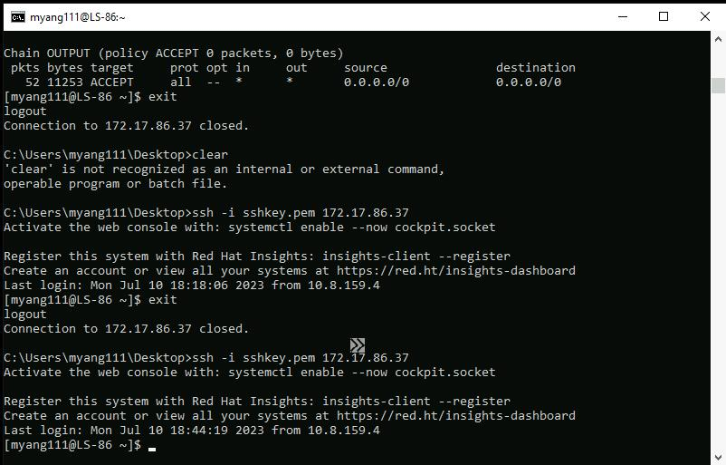
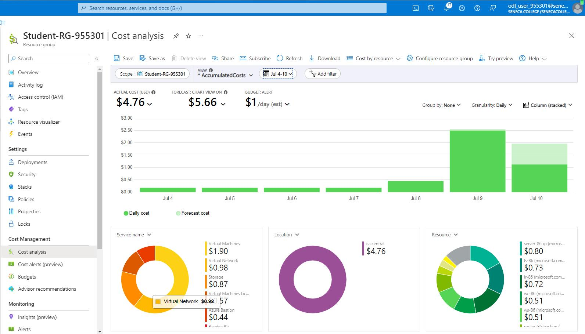
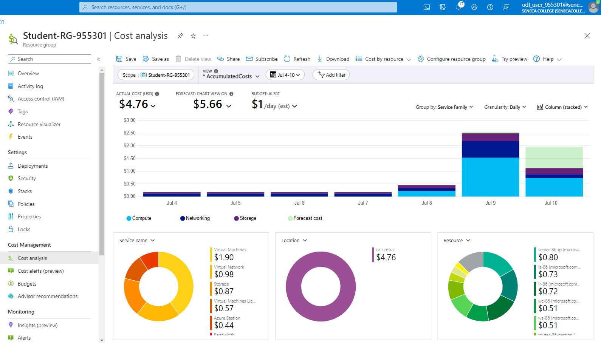
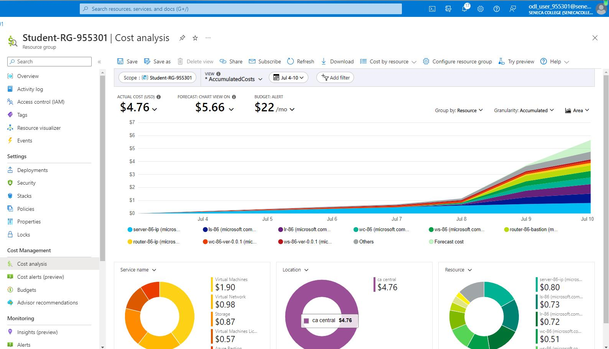
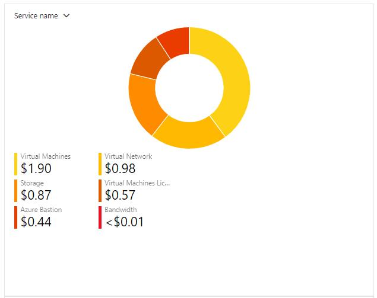
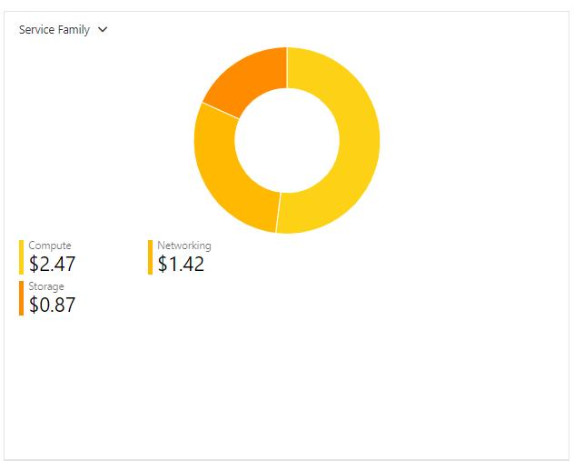
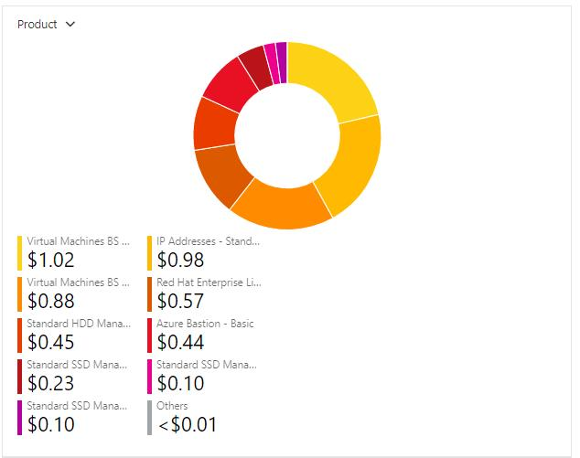
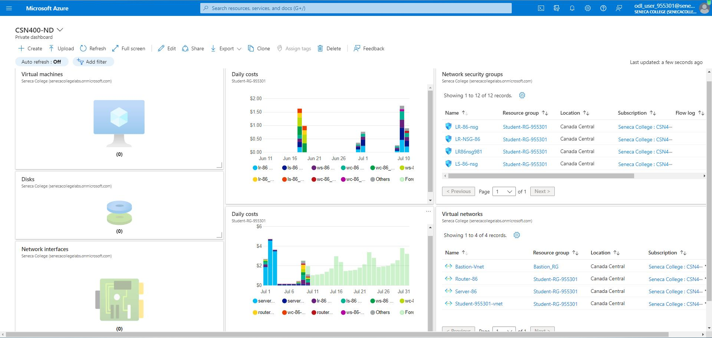

# Checkpoint8 Submission

- **COURSE IMFORMATION: CSN400-2234**
- **STUDENT'S NAME: Martin Yang**
- **STUDENT'S NUMBER: 152269205**
- **GITHUB USER_ID: 152269205-myseneca**
- **TEACHER'S NAME: Atoosa Nasiri**

# Table of Contents

1. [Part A - Creating & Configuring VMs - Using Azure CLI Scripts](#part-a---creating--configuring-vms---using-azure-cli-scripts)
2. [Part B - Basic Connectivity - Linux VMs Firewall Setting](#part-b---basic-connectivity---linux-vms-firewall-setting)
3. [Part C - Azure Cost Analysis Charts](#part-c---azure-cost-analysis-charts)

---

## Part A - Creating & Configuring VMs - Using Azure CLI Scripts

1.Get a list of your VM, NSG, NIC, and Disks using Azure CLI in table format. Do not include screenshots, just embed the output in table format in your submission.
```bash
az vm list --resource-group Student-RG-955301 --output table
Name    ResourceGroup      Location       Zones
------  -----------------  -------------  -------
LR-86   Student-RG-955301  canadacentral
LS-86   Student-RG-955301  canadacentral
WC-86   Student-RG-955301  canadacentral
WS-86   Student-RG-955301  canadacentral

```
```bash
myang111@DESKTOP-Q44JQBJ:/mnt/e/CSN400/CSN400-Capstone-Public/bash2$ az network nsg list --resource-group Student-RG-955301 --output table        
Location       Name        ProvisioningState    ResourceGroup      ResourceGuid
-------------  ----------  -------------------  -----------------  ------------------------------------
canadacentral  LR-86-nsg   Succeeded            Student-RG-955301  5c675514-8ef8-4fef-a70f-2aba2df28121
canadacentral  LR-NSG-86   Succeeded            Student-RG-955301  18fe8111-9d47-471c-bd6e-3cf5678fd2a4
canadacentral  LR86nsg981  Succeeded            Student-RG-955301  75b9f216-88f3-4ba5-8358-02820ac36d03
canadacentral  LS-86-nsg   Succeeded            Student-RG-955301  67ecbe55-1adf-43c9-925c-f07a5c919ce6
canadacentral  LS-NSG-86   Succeeded            Student-RG-955301  3a7cb027-c86f-4773-a98b-74093347f1bc
canadacentral  LS86nsg100  Succeeded            Student-RG-955301  0c8be7f4-6f9e-4d86-ba00-b08e644efcf7
canadacentral  WC-86-nsg   Succeeded            Student-RG-955301  04eae9a0-7400-46c4-9a13-f3fb85e35168
canadacentral  WC-NSG-86   Succeeded            Student-RG-955301  64d4010e-517a-49e4-8c03-802e4bc00e7b
canadacentral  WC86nsg389  Succeeded            Student-RG-955301  b5793006-7f07-4865-9e3b-91f7a8e1d12b
canadacentral  WS-86-nsg   Succeeded            Student-RG-955301  e02670c0-8dda-4c1b-a45b-79a84238028c
canadacentral  WS-NSG-86   Succeeded            Student-RG-955301  edaa0585-0aa8-4845-a897-07f148632f19
canadacentral  WS86nsg464  Succeeded            Student-RG-955301  32f1e8dd-e2b9-47e7-902e-4389a08db37f


```
```bash

az network nic list --resource-group Student-RG-955301 --output table        
EnableAcceleratedNetworking    EnableIPForwarding    Location       MacAddress         Name    NicType    Primary    ProvisioningState    ResourceGroup      ResourceGuid                          VnetEncryptionSupported 
-----------------------------  --------------------  -------------  -----------------  ------  ---------  ---------  -------------------  -----------------  ------------------------------------  -------------------------
False                          True                  canadacentral  60-45-BD-5E-FB-1B  lr-86   Standard   True       Succeeded            Student-RG-955301  c62e34e2-d838-42e5-949e-1475392ac557  False
False                          False                 canadacentral  60-45-BD-61-75-87  ls-86   Standard   True       Succeeded            Student-RG-955301  b5b0c717-e174-43cd-b243-fe3885cad77d  False
False                          False                 canadacentral  00-0D-3A-84-2D-03  wc-86   Standard   True       Succeeded            Student-RG-955301  795b745a-6eac-4b8b-9409-08e15c77ffac  False
False                          False                 canadacentral  00-0D-3A-0C-34-3E  ws-86   Standard   True       Succeeded            Student-RG-955301  9a942ed2-cc08-4670-a12a-2771fecf93c2  False

```
```bash

az disk list --resource-group Student-RG-955301 --output table
Name                                             ResourceGroup      Location       Zones    Sku              OsType    SizeGb    ProvisioningState-----------------------------------------------  -----------------  -------------  -------  ---------------  --------  --------  -------------------
LR-86_OsDisk_1_85870afc7c1646fe9dbfa94c3d6e9797  Student-RG-955301  canadacentral           StandardSSD_LRS  Linux     64        Succeeded        
LS-86_OsDisk_1_cb98532d7fa64e37a774c2bbbebd01b9  Student-RG-955301  canadacentral           StandardSSD_LRS  Linux     64        Succeeded        
WC-86_OsDisk_1_2f69d2362f934adba46f7e4dd423b53e  Student-RG-955301  canadacentral           StandardSSD_LRS  Windows   127       Succeeded        
WS-86_OsDisk_1_4fdabe528cdc4a1eabcd1cd68188a480  Student-RG-955301  canadacentral           StandardSSD_LRS  Windows   127       Succeeded        
```


2. Why are you creating NIC separate from VM? What happens when you delete a VM, is that attached NIC automatically deleted? Why?

>A: Creating a NIC separate from a VM allows more flexibility in managing network resources. When I delete a VM, the NIC is usually automatically deleted to ensure that resources are cleaned up. This allows for easier reuse of NICs with other VMs if needed.

3.When you created VMs from Portal can you use an existing NIC? Do you consider this a limitation in working from Portal for VM creation?

>A:When creating VMs, we create a new NIC for each VM. This NIC is like a virtual network adapter that connects the VM to the network. If we want to use an existing NIC for our new VMs, we can do it easier in Azure CLI instead of the Azure portal. 

4.What rules did we add to Network Security Groups (NSG)? What does each rule do?

>A:We can add SSH,RDP,HTTP,HTTPS,DNS,NTP etc to the NSG.
>1.SSH Rule:Allows you to connect to a VM using a secure remote     access method called SSH. It enables you to run commands and     manage the VM remotely.

>2.RDP Rule:Enables you to connect to a Windows-based VM using      a protocol called Remote Desktop Protocol (RDP). It allows you to         access and control the VM's desktop remotely.

>3.HTTP Rule:Permits incoming connections on port 80, which is         used for web browsing. It allows users to access websites hosted on     the VM.

>4.DNS Rule:Permits outgoing connections on port 53, allowing the     VM to perform DNS resolution. It enables the VM to look up and     translate domain names into IP addresses.

5.Run a command in CLI that lists all your Custom Images. Change the output format to table format and embed the answer in your submission.
```bash
Iamge List
HyperVGeneration    Location       Name             ProvisioningState    
ResourceGroup
------------------  -------------  ---------------  -------------------  
-----------------
V2                  canadacentral  lr-86-ver-0.0.1  Succeeded
Student-RG-955301
V2                  canadacentral  lr-86-ver-V2     Succeeded
Student-RG-955301
V2                  canadacentral  ls-86-ver-0.0.1  Succeeded
Student-RG-955301
V2                  canadacentral  ls-86-ver-V2     Succeeded
Student-RG-955301
V2                  canadacentral  wc-86-ver-0.0.1  Succeeded
Student-RG-955301
V2                  canadacentral  wc-86-ver-V2     Succeeded
Student-RG-955301
V2                  canadacentral  ws-86-ver-0.0.1  Succeeded
Student-RG-955301
V2                  canadacentral  ws-86-ver-V2     Succeeded
Student-RG-955301
```

6.Delete your VMs using the proper script after your work is completed. Run a command in CLI that lists all your VMs.

>Since all the vms have been deleted
```bash
Name  ResourceGroup  PowerState  Location
----- -------------- ----------- -----------
```
7.Get a list of your VM, NSG, NIC, and Disks using Azure CLI in table format. Which ones are empty? Do not include screenshots, just embed the output in table format in your submission.

>A: The VMs, NIC, Disks


## Part B - Basic Connectivity - Linux VMs Firewall Setting

1.Run commands that show the status of the Apache server and MariDB server in your LS-86. Embed the output as a bash snippet.
```bash
Apache server status: active
MariaDB server status: active
```

2.Run a command in LR-86 that show iptables chains. What is the default setting? How could you improve these settings to be less vulnerable to attacks?
```bash
sudo iptables -L --line-number
DEFAULT:
Chain INPUT (policy ACCEPT)
num  target     prot opt source               destination
1    ACCEPT     all  --  anywhere             anywhere             state RELATED,ESTABLISHED
2    ACCEPT     icmp --  anywhere             anywhere
3    ACCEPT     all  --  anywhere             anywhere
4    ACCEPT     tcp  --  anywhere             anywhere             state NEW tcp dpt:ssh
5    REJECT     all  --  anywhere             anywhere             reject-with icmp-host-prohibited

Chain FORWARD (policy ACCEPT)
num  target     prot opt source               destination
1    REJECT     all  --  anywhere             anywhere             reject-with icmp-host-prohibited

Chain OUTPUT (policy ACCEPT)
num  target     prot opt source               destination

A:Default setting is like this : 
Chain INPUT/FORWARD/OUTPUT (policy ACCEPT)
num  target     prot opt source               destination
```

>To make it  less vulnerable to attacks, we can 1.make rules for the specific traffic port. 2.Limit the connection attempts.
>3.Update regularly.


3.Run a command that shows the hostname in LR-XX and LS-XX and embed the output in your submission.
```bash
sudo hostnamectl status
   Static hostname: LS-86.CSN4002234.com
         Icon name: computer-vm
           Chassis: vm
        Machine ID: c30654a8e7de4cd68b942774c4e1ccca
           Boot ID: ee24f32f2d944414855dc884bbb12ae0
    Virtualization: microsoft
  Operating System: Red Hat Enterprise Linux 8.8 (Ootpa)
       CPE OS Name: cpe:/o:redhat:enterprise_linux:8::baseos
            Kernel: Linux 4.18.0-477.10.1.el8_8.x86_64
      Architecture: x86-64
```
```bash

Static hostname: LR-86.CSN4002234.com
         Icon name: computer-vm
           Chassis: vm
        Machine ID: c30654a8e7de4cd68b942774c4e1ccca
           Boot ID: 44d0407f89f14b508cc4277b7eb5a039
    Virtualization: microsoft
  Operating System: Red Hat Enterprise Linux 8.8 (Ootpa)
       CPE OS Name: cpe:/o:redhat:enterprise_linux:8::baseos
            Kernel: Linux 4.18.0-477.10.1.el8_8.x86_64
      Architecture: x86-64
```


4.Submit your lr_iptables.txt and ls_iptables.txt files. Do not embed them in your README.md, just add it in your folder and give a hyperlink.

- [lr-iptables.txt](./contents/lr_iptables.txt)

- [ls-iptables.txt](./contents/ls_iptables.txt)

5.Test your firewall settings and your configurations for connectivity.



                                                                           


## Part C - Azure Cost Analysis Charts

| No. | Scope | Chart Type | VIEW Type |  Date Range | Group By | Granularity| Example |
|-|-|-|-|-|-|-|-|
|1|Student-RG-955301| Column (Stacked) | DailyCosts | Last 7 Days | Resource | Daily |  |
|2|Student-RG-955301| Column (Stacked) | DailyCosts | Last 7 Days | Service | Daily |  |
|3|Student-RG-955301| Area| AccumulatedCosts | Last 7 Days | Resource | Accumulated |  |
|4|Student-RG-955301| Pie Chart | NA | Last Month | Service Name | NA |  |
|5|Student-RG-955301| Pie Chart | NA | Last Month | Service Family | NA |  |
|6|Student-RG-955301| Pie Chart | NA | Last Month | Product | NA |  |


### Customized Azure Dashboard

