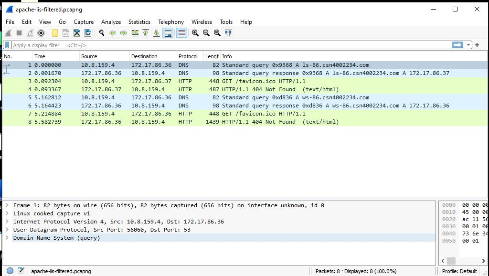
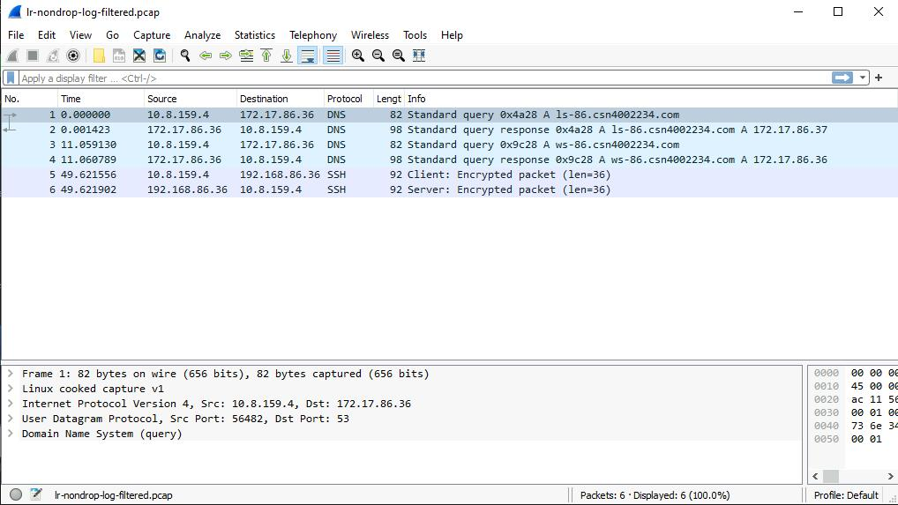

# Checkpoint9 Submission

- **COURSE IMFORMATION: CSN400-2234**
- **STUDENT'S NAME: Martin Yang**
- **STUDENT'S NUMBER: 152269205**
- **GITHUB USER_ID: 152269205-myseneca**
- **TEACHER'S NAME: Atoosa Nasiri**


### Table of Contents

1. [Part A – Logging and Analyzing DNS and HTTP Traffic](#part-a---logging-and-analyzing-dns-and-http-traffic)
2. [Part B – Logging and Analyzing FTP and MySQL Traffic](#part-b---logging-and-analyzing-ftp-and-mysql-traffic)
3. [Part C – Adjusting firewalls to DROP and LOG Traffic](#part-c---adjusting-firewalls-to-drop-and-log-traffic)
4. [Part D - Azure Cost Analysis Charts](#part-d---azure-cost-analysis-charts)


## Part A - Logging and Analyzing DNS and HTTP Traffic

  

## Part B - Logging and Analyzing FTP and MySQL Traffic
  


## Part C - Adjusting firewalls to DROP and LOG Traffic

```bash
# Insert rules to DROP and LOG FTP traffic
iptables -A FORWARD -p tcp --dport 21 -d 172.17.86.36 -j LOG --log-prefix "FTP_DROP "
iptables -A FORWARD -p tcp --dport 21 -d 172.17.86.36 -j DROP

# Insert rules to DROP and LOG SSH traffic
iptables -A FORWARD -p tcp --sport 22 -s 172.17.86.37 -j LOG --log-prefix "SSH_DROP "
iptables -A FORWARD -p tcp --sport 22 -s 172.17.86.37 -j DROP
```

 
```
 


## Part D - Azure Cost Analysis Charts

| No. | Scope | Chart Type | VIEW Type |  Date Range | Group By | Granularity| Example |
|-|-|-|-|-|-|-|-|
|1|Student-RG-955301| Column (Stacked) | DailyCosts | Last 7 Days | Resource | Daily |  |
|2|Student-RG-955301| Column (Stacked) | DailyCosts | Last 7 Days | Service | Daily |  |
|3|Student-RG-955301| Area| AccumulatedCosts | Last 7 Days | Resource | Accumulated |  |
|4|Student-RG-955301| Pie Chart | NA | Last Month | Service Name | NA |  |
|5|Student-RG-955301| Pie Chart | NA | Last Month | Service Family | NA |  |
|6|Student-RG-955301| Pie Chart | NA | Last Month | Product | NA |  |

### Customized Azure Dashboard

